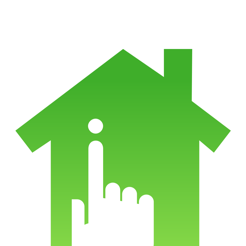

<p align="center">
  
  <span style="position: relative; top: 20px">
    
  </span>
</p>

# MiHome Gateway Platform Plugin

[](https://github.com/homebridge/homebridge/wiki/Verified-Plugins)

Energenie MiHome gateway plugin for [Homebridge](https://github.com/nfarina/homebridge).

# Installation

1. Install Homebridge using: `npm install -g homebridge`
2. Install this plugin using: `npm install -g homebridge-mihomegateway`
3. Update your configuration file. See the sample below.

# Updating

- `npm update -g homebridge-mihomegateway`

# Configuration

Currently, the setup is a bit convoluted - sorry about that!

This will all be automated in upcoming releases but for now a bit of manual work is required.

## Sample Configuration

```json
"platforms": [{
    "platform": "MiHomeGateway",
    "name": "",
    "username": "",
    "password": "",
    "baseUrl": ""
}]
```
- `accessory` - must be set to **MiHomeGateway**
- `name` - not currently used but set to a friendly label for the MiHome bridge
- `username` - call the [register user service](https://mihome4u.co.uk/docs/api-documentation/users-api/sign-up-a-new-user) to create a new api user
- `password` - the password you used to register with. Your password is only used for one initial authentication call. Subsequent calls will use the api key obtained during authentication.
- `baseUrl` - [optional] an override for the MiHome API URL

## TODO
- Add additional device types (currently only supports light switches)
- Automate registration
- Extract MiHome API calls into separate library

## Credits
- Adrian Rudman for [homebridge-platform-wemo](https://github.com/rudders/homebridge-platform-wemo) which I based this plugin on
